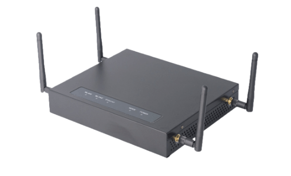
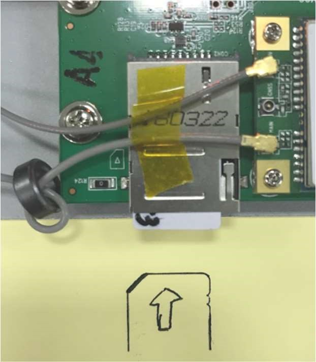
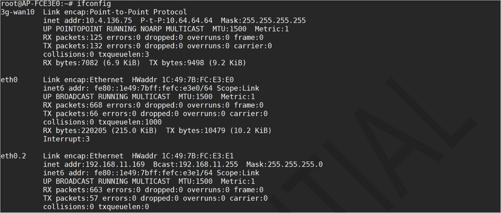
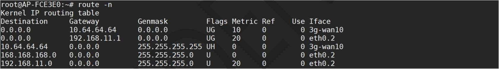
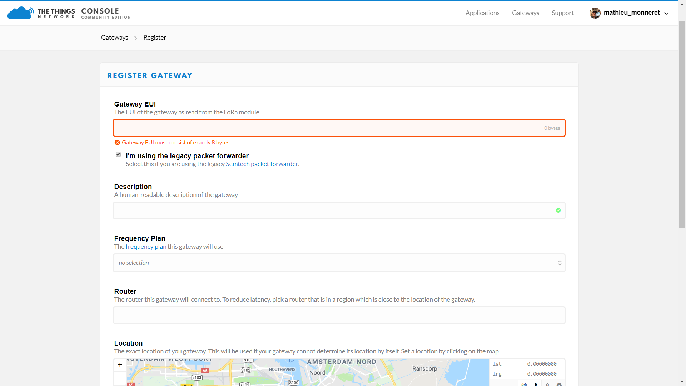
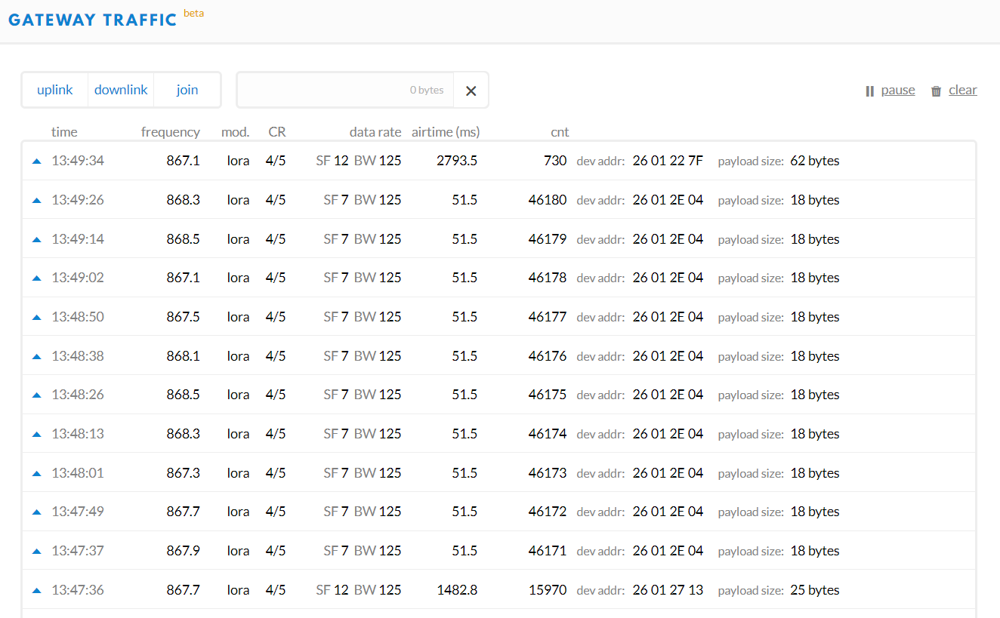

# Browan - Indoor Pico Gateway

This Gateway can be configurated to use LTE backhaul but this is optional.  
If you don't use the LTE configuration, it uses Ethernet as a backhaul (DHCP mode).  

## Salient features

- Compliance to LoRaWAN 1.0.3
- Up to 16 concurrent channels for LoRa transmission
- 2.4G 802.11b/g/n 2x2 Wireless LAN
- Optional support a wide frequency range from 862MHz to
928MHz in different SKU
- Wi-Fi AP/Client mode available
- Support Listen Before Talk for downlink
- Patented repeater mode for last mile coverage
- Various Internet connection: Ethernet, Wireless bridge,
3G/4G dongle
- Web UI for LoRa and network configuration
- Cloud service for gateway health monitoring
- Support OTA and USB upgrade

## Configuration

1. (optional) open the top cover of the gateway and inser a SIM card as shown in the picture bellow:

2. Connect the gateway's WAN port to a router's LAN port and connect your computer to the router.
3. Find The IP adress of the gateway and SSH login with the following credentials:  

   `login: root`  
   `password: root`
   
4. if you want to set the LTE configuration use the following command lines, if not skip to step 6.

    `fw_setenv apn "XXXXXXXX"` stets the **APN**  
    `fw_setenv pincode  "XXXXXXXX"` (OPTIONAL)  
    `fw_setenv username "XXXXXXXX"` (OPTIONAL)  
    `fw_setenv password "XXXXXXXX"` (OPTIONAL)  
    `fw_setenv dial_num “XXXXXXXX”` (OPTIONAL)(default:*99#)
   
5. reboot the gateway:

    `sync;reboot`
   
    If the Internet LED is **Green** it means that the gateway is correctly configured with LTE.

6. SSH login using the same IP adress and check the gateway status by using the following command lines:
  
  `ifconfig`
  
   

   `route -n`
   
   

   `netstat -anup | grep lora_pkt_fwd`:
   
   
   
7. Get the **Gateway ID** (blured part) with the following command line:

  `ps | grep lora_pkt_fwd | grep -v grep`
  
   

You are now done configuring your gateway.

## Connection to The Things Network

1. Go to [**TheThingsNetwork console -> Gateways -> Register**](https://console.thethingsnetwork.org/gateways/register)
2. Select **I'm using the legacy packet forwarder** and enter the **Gateway EUI:** `00 00 Gateway ID`

   
   
3. Complete the rest of the fields such as `location`, `frequency plan` and `router`.
4. If everything went right in **Overview** you should see the **status:** `🧶connected` and in **Traffic** the packets that the gateway recieves.

