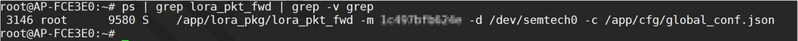

# Browan - Indoor Pico Gateway

This Gateway can be configurated to use LTE backhaul but this is optional.  
If you don't use the LTE configuration, it uses Ethernet as a backhaul (DHCP mode).  

## Salient features

- Compliance to LoRaWAN 1.0.3
- Up to 16 concurrent channels for LoRa transmission
- 2.4G 802.11b/g/n 2x2 Wireless LAN
- Optional support a wide frequency range from 862MHz to
928MHz in different SKU
- Wi-Fi AP/Client mode available
- Support Listen Before Talk for downlink
- Patented repeater mode for last mile coverage
- Various Internet connection: Ethernet, Wireless bridge,
3G/4G dongle
- Web UI for LoRa and network configuration
- Cloud service for gateway health monitoring
- Support OTA and USB upgrade

## Configuration

1. (optional) open the top cover of the gateway and inser a SIM card as shown in the picture bellow:  

2. Connect the gateway's WAN port to a router's LAN port.
3. Connect your computer to the router.
4. find The IP adress of the gateway (Ethernet Port), and use it to SSH login with the following credentials:

   `login: root`  
   `password: root`
   
5. (Optional) LTE configuration:

   **APN:** `fw_setenv apn "XXXXXXXX"`
   
   (OPTIONAL) PIN CODE / USERNAME / PASSWORD / DIAL_NUM(default:*99#)  
      `fw_setenv pincode  "XXXXXXXX"`  
      `fw_setenv username "XXXXXXXX"`  
      `fw_setenv password "XXXXXXXX"`  
      `fw_setenv dial_num “XXXXXXXX”`
6. reboot the gateway:

   `sync;reboot`
   
If the Internet LED is **Green** it means that the gateway is correctly configured with LTE.

7. SSH login using the same IP adress (Ethernet Port)
8. Check the gateway status:

   **ifconfig:** `ifconfig`  
   

   **routing:** `route -n`  
   

   **lora_pkt_fwd:** `ps | grep lora_pkt_fwd | grep -v grep`  
   

   **Gateway ID:** the blured part `XXXXXXXXXXXX`

   **netstat:** `netstat -anup | grep lora_pkt_fwd`  
   

You are now done configuring your gateway.

## Connecting to The Things Stack

1. Go on The Things Stack.
2. Go to [**Gateways -> Register**](https://console.thethingsnetwork.org/gateways/register)
3. Select **I'm using the legacy packet forwarder** and enter the **Gateway EUI:** `00 00 XX XX XX XX XX XX`  
   (just add `0000` before the `Gateway ID`)  
   
   
4. Complete the rest of the fields such as `location`, `frequency plan` and `router`.
5. If everything went right in **Overview** you should see the **status:** `🧶connected` and in **Traffic** the packets that the gateway recieves.